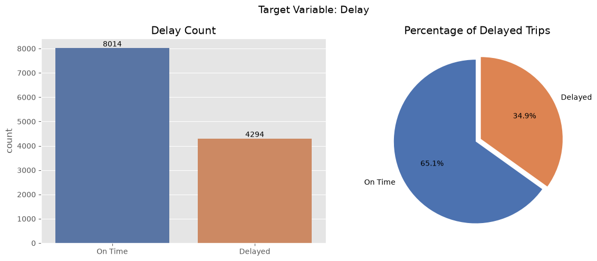
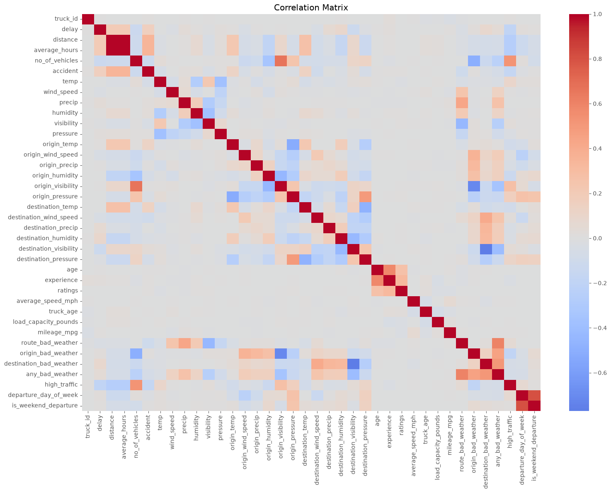
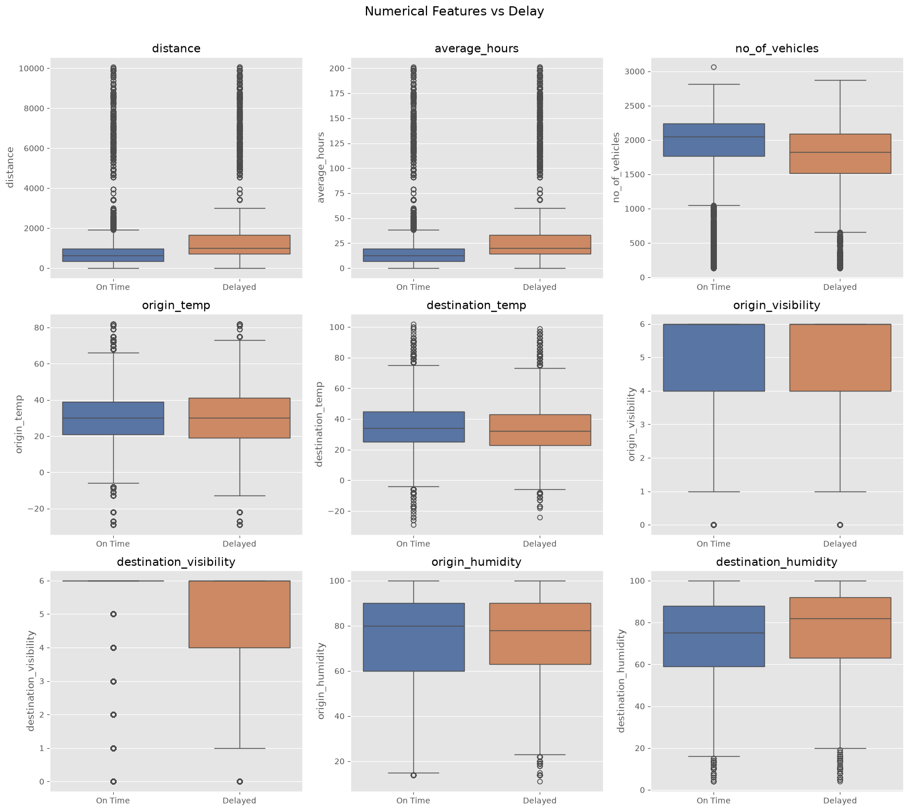

# 🚚 Truck Delay Prediction Pipeline

An end-to-end Machine Learning pipeline for predicting truck shipment delays using weather, traffic, route, driver, and vehicle information.

This project demonstrates the complete data engineering and machine learning workflow, from raw data ingestion through feature engineering, exploratory data analysis, and model training.

---

## Project Overview

Delayed truck shipments increase operational costs, reduce customer satisfaction, and make logistics planning more difficult.

The goal of this project is to build a complete machine learning pipeline capable of predicting whether a truck shipment will be delayed using historical operational data.

The pipeline performs:

- Loading data from multiple sources
- Data cleaning and preprocessing
- Feature engineering
- Dataset merging
- Exploratory Data Analysis (EDA)
- Model training and evaluation
- Model persistence

---
## Highlights

- End-to-end Machine Learning pipeline
- Multi-table data integration (7 datasets)
- 12,308 truck trips processed
- 48 engineered features
- Time-based train/test split
- Exploratory Data Analysis (EDA)
- Random Forest achieved **78.2% accuracy**
- Modular Python project structure
- Optional AWS RDS/SageMaker integration template

---

## Project Structure

```
truck_delay_pipeline/

├── data/
│   ├── raw/
│   └── processed/
│
├── notebooks/
│   └── 01_eda.ipynb
│
├── models/
│
├── src/
│   ├── config.py
│   ├── load_data.py
│   ├── clean_data.py
│   ├── merge_data.py
│   ├── feature_engineering.py
│   ├── profile_data.py
│   ├── train_model.py
│   └── aws_rds_template.py
│
├── requirements.txt
├── README.md
└── .gitignore
```

---

## Dataset

The project combines multiple datasets describing truck operations:

- Drivers
- Trucks
- Routes
- Truck Schedule
- Route Weather
- City Weather
- Traffic

The final merged dataset contains **12,308 truck trips** and **48 engineered features**.

---

## Machine Learning Pipeline

```
Raw CSV Files
      │
      ▼
load_data.py
      │
      ▼
clean_data.py
      │
      ▼
merge_data.py
      │
      ▼
feature_engineering.py
      │
      ▼
EDA Notebook
      │
      ▼
train_model.py
      │
      ▼
Saved Models
```

---

## Feature Engineering

Examples of engineered features include:

- High traffic indicator
- Route bad weather flag
- Origin bad weather flag
- Destination bad weather flag
- Any bad weather flag
- Departure day of week
- Weekend departure indicator

---

## Exploratory Data Analysis

The notebook includes:

- Dataset overview
- Missing value analysis
- Delay distribution
- Numerical feature histograms
- Correlation heatmap
- Feature vs Delay boxplots

---
## Results

### Delay Distribution

The dataset contains 12,308 truck trips.

- **On-Time Trips:** 8,014 (65.1%)
- **Delayed Trips:** 4,294 (34.9%)



---

### Feature Distributions

Histograms of the engineered numerical features reveal realistic traffic, weather, and route characteristics with no significant data quality issues.


---

### Correlation Heatmap

Correlation analysis identifies relationships between route characteristics, weather conditions, and engineered traffic features.



---

### Delay vs Feature Boxplots

Boxplots compare the distribution of each numerical feature for delayed and on-time trips.



---

## Models

Two baseline models were trained.

### Logistic Regression

- Accuracy: **65.1%**
- ROC AUC: **0.673**

### Random Forest

- Accuracy: **78.2%**
- Precision: **85.2%**
- Recall: **53.9%**
- ROC AUC: **0.813**

The Random Forest model demonstrated significantly better predictive performance by capturing non-linear relationships between traffic, weather, and route characteristics.

---

## Technologies Used

### Programming

- Python

### Data Processing

- Pandas
- NumPy

### Visualization

- Matplotlib
- Seaborn

### Machine Learning

- Scikit-learn
- Joblib

---

## Running the Project

Clone the repository

```bash
git clone https://github.com/Bennyaks/Truck_Delay_Pipeline.git
cd Truck_Delay_Pipeline
```

Install dependencies

```bash
pip install -r requirements.txt
```

Run the training pipeline

```bash
python src/train_model.py
```

Open the exploratory notebook

```bash
notebooks/01_eda.ipynb
```

---

## Model Performance

| Model | Accuracy | Precision | Recall | F1 Score | ROC-AUC |
|-------|---------:|----------:|-------:|---------:|--------:|
| Logistic Regression | 65.11% | 64.30% | 25.31% | 36.32% | 0.673 |
| Random Forest | **78.19%** | **85.15%** | **53.93%** | **66.03%** | **0.813** |

## Optional AWS Extension

The original project specification includes deployment using:

- AWS RDS (MySQL)
- AWS RDS (PostgreSQL)
- AWS SageMaker
- Hopsworks Feature Store

This repository includes:

```
src/aws_rds_template.py
```

This file is intentionally provided as a **commented reference implementation** showing how the pipeline can be migrated from local CSV files to AWS RDS.

To use it:

1. Create AWS RDS instances.
2. Restore the provided SQL dumps.
3. Configure environment variables.
4. Uncomment the template.
5. Replace the CSV loader with the RDS loader.

No changes are required elsewhere in the pipeline.

---

## Author

**Benard Mandera Nyakoni**

GitHub:

https://github.com/Bennyaks